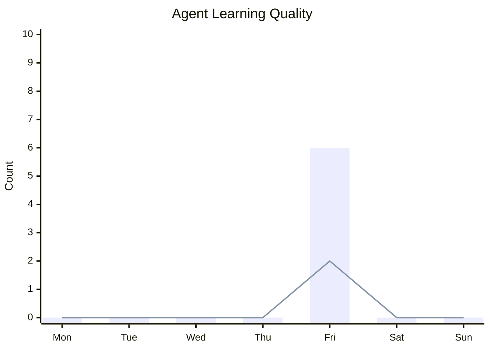
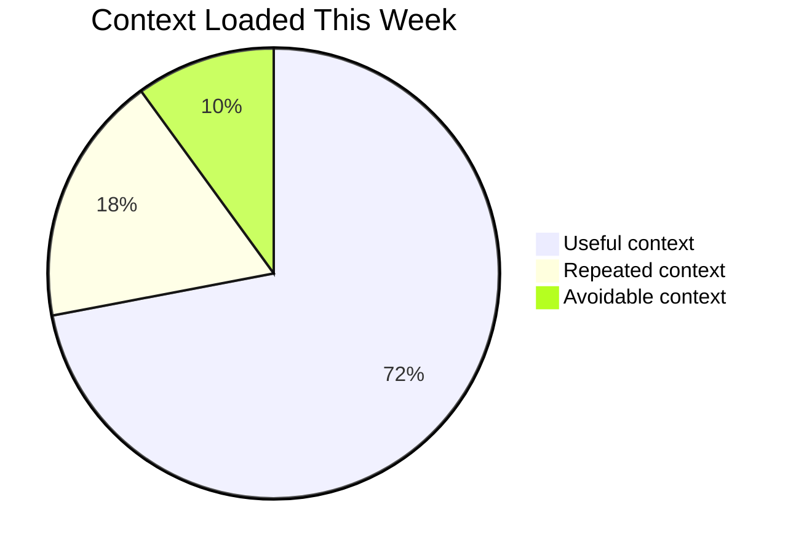
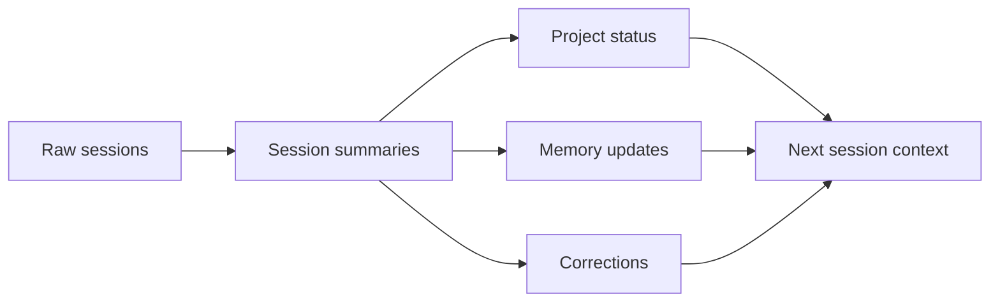

# Weekly Analytics - 2026-W24

## Snapshot

This is the starter analytics note for Kxran-OS. It shows the intended dashboard style: minimalist graphs first, exact metrics second, then written interpretation and next-week fixes.

## Learning Graph

## Context Efficiency

## Memory Flow

## Metrics

| Area | Metric | Value |
|---|---|---:|
| Learning | New durable memories | 6 |
| Learning | Corrections logged | 2 |
| Learning | Repeated mistakes | 0 |
| Learning | Stale memories removed | 0 |
| Productivity | Sessions completed | 1 |
| Productivity | Projects touched | 1 |
| Productivity | Decisions made | 6 |
| Productivity | Tasks completed | 4 |
| Context | Estimated context loaded | unknown |
| Context | Avoidable context | unknown |
| Context | Avg files loaded/session | unknown |
| Context | Full-history reads avoided | 1 |

## What Improved

- Kxran-OS now has clear startup rules.
- Session history has an index and an active handoff file.
- Project status is separated from raw session history.
- Analytics now combine graphs, metrics, and written review.

## What Repeated

- No repeated mistakes yet. This is the first sample analytics note.

## Best Memory Updates

- Raw sessions are archives, not startup context.
- Project status beats session history when they conflict.
- Token efficiency is a first-class design goal.
- Weekly analytics need visual and written interpretation together.

## Next Week Fixes

- Replace sample metrics with real usage data.
- Fill personalized context in `Context/`.
- Keep `Context/agent-brief.md` short enough to load every session.
- Create a weekly closeout habit after several real sessions.
