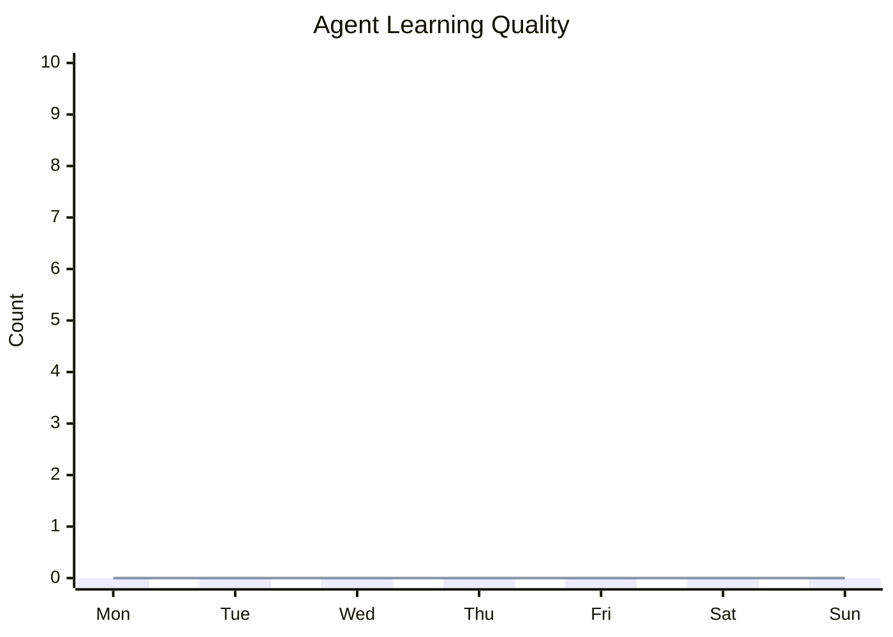
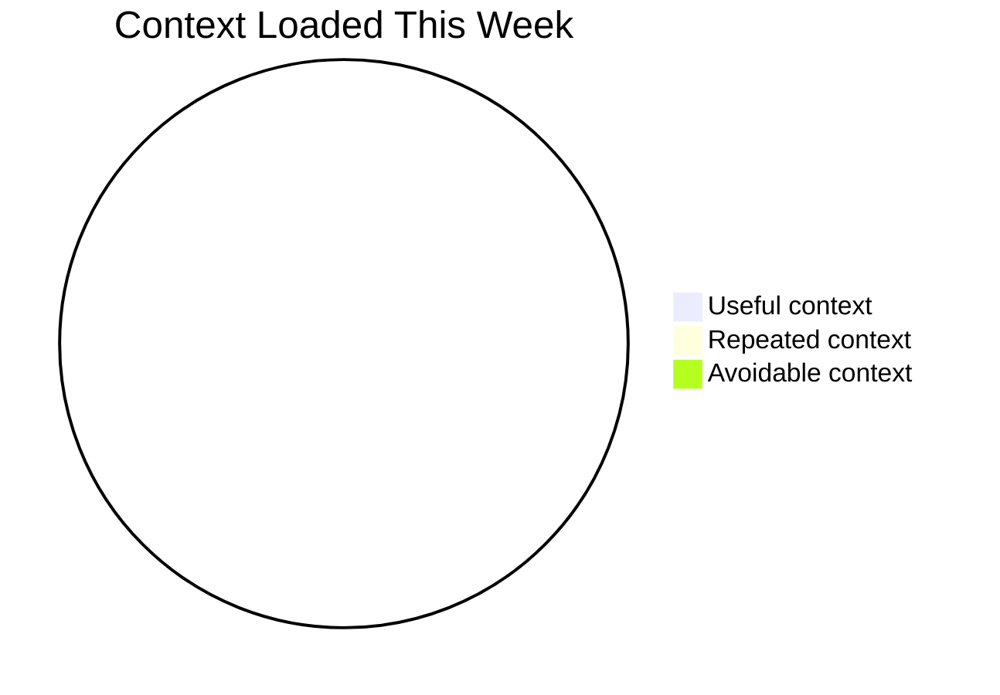
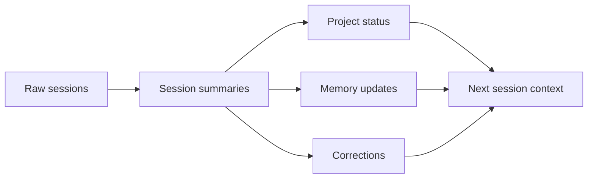

# Weekly Analytics - YYYY-Www

## Snapshot

## Learning Graph

## Context Efficiency

## Memory Flow

## Metrics

| Area | Metric | Value |
|---|---|---:|
| Learning | New durable memories | 0 |
| Learning | Corrections logged | 0 |
| Learning | Repeated mistakes | 0 |
| Learning | Stale memories removed | 0 |
| Productivity | Sessions completed | 0 |
| Productivity | Projects touched | 0 |
| Productivity | Decisions made | 0 |
| Productivity | Tasks completed | 0 |
| Context | Estimated context loaded | 0 |
| Context | Avoidable context | 0 |
| Context | Avg files loaded/session | 0 |
| Context | Full-history reads avoided | 0 |

## What Improved

## What Repeated

## Best Memory Updates

## Next Week Fixes
