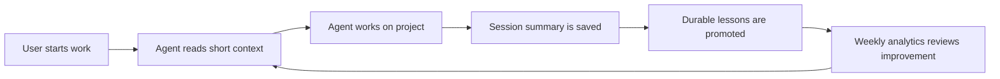

# 01 - OS Map

Kxran-OS is designed to solve one recurring problem: AI agents forget context between sessions, and humans lose decisions inside long chats.

This vault fixes that by giving every future session a shared filesystem memory.

## The Core Loop

## Why It Is Token Efficient

The OS does not ask the agent to read everything.

Instead, the agent reads:

1. the short brief;
2. the current project status;
3. the active session handoff;
4. only the relevant older sessions if a specific question requires them.

This avoids wasting tokens on stale history.

## Why It Reduces Hallucination

Loading all history can create contradictions. Old notes may be stale, wrong, or superseded.

Kxran-OS reduces hallucination by separating:

- **truth**: current status and source-of-truth files;
- **memory**: durable facts that still matter;
- **history**: old sessions that may need interpretation;
- **corrections**: known mistakes and future behavior changes.

When files conflict, current project status wins over old sessions.

## The Current V1 Design

V1 is intentionally simple:

- local-first;
- Markdown-first;
- no custom plugin;
- no MCP automation yet;
- no forced Git or Obsidian Sync yet;
- model-agnostic by default.

The goal is to prove the workflow locally before adding heavier automation.
