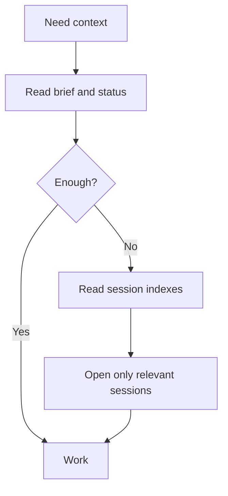

# 03 - Agent Workflow

This note explains how an AI agent should work with Kxran-OS.

## Startup Workflow

When starting a normal session, the agent should read:

1. `Context/agent-brief.md`
2. `Context/retrieval-map.md`
3. the relevant project `README.md`
4. the relevant project `status.md`
5. `Sessions/active.md`

That should usually be enough.

## When To Read Older Sessions

Read older sessions only when the task needs history.

Good reasons:

- finding an old decision;
- checking why something changed;
- resolving a repeated mistake;
- continuing an exact thread of work;
- debugging a previous failed attempt.

Bad reasons:

- "just in case";
- trying to load the whole vault;
- replacing current project status with old chat history.

## Work Workflow

During work, the agent should keep facts separated:

- Put current project state in `Projects/<project>/status.md`.
- Put durable user/agent memory in `Context/memory.md`.
- Put corrections in `Context/corrections.md`.
- Put historical narrative in a session note.
- Put weekly reflection in `Analytics/weekly/`.

## Closeout Workflow

At the end of a meaningful session:

1. Create or update the session note.
2. Update `Sessions/_index.md`.
3. Update `Sessions/active.md`.
4. Update project `status.md`.
5. Promote durable lessons into `Context/memory.md`.
6. Promote corrections into `Context/corrections.md`.
7. Add analytics-ready counts if possible.

## Token Efficiency Rules

The agent should prefer short, current files over long, old files.

## What To Do When Files Conflict

Use this precedence:

1. Current user instruction.
2. Project `status.md`.
3. Durable memory and corrections.
4. Project README.
5. Session summaries.
6. Raw old sessions.

If still uncertain, state the conflict clearly and ask the user.
