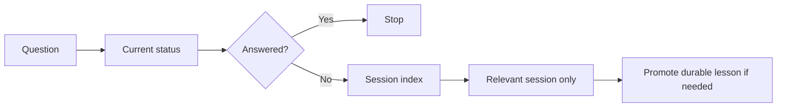

# 04 - Session And Memory System

This note explains how Kxran-OS remembers things without loading everything.

## The Four Memory Types

Kxran-OS separates memory into four types.

| Type | Stored In | Purpose |
|---|---|---|
| Current state | `Projects/<project>/status.md` | What is true now |
| Durable memory | `Context/memory.md` | Facts and preferences that persist |
| Corrections | `Context/corrections.md` | Mistakes and behavior changes |
| History | `Sessions/YYYY/MM/` | What happened in past sessions |

## Why Sessions Are Chronological

Sessions are stored by date because time is the natural archive.

Example:

`Sessions/2026/06/2026-06-12-kxran-os-bootstrap.md`

This avoids duplicating sessions across multiple projects. Project folders link to relevant sessions using `Projects/<project>/sessions.md`.

## What Goes Into A Session Note

A session note should include:

- goal;
- context used;
- work done;
- decisions;
- mistakes and corrections;
- memory updates;
- follow-ups.

The note should summarize the session, not copy every token of the chat.

## What Goes Into Memory

Use `Context/memory.md` for things future agents should remember across sessions.

Examples:

- user preferences;
- stable project principles;
- model-agnostic design choices;
- recurring constraints;
- durable decisions.

Do not put temporary task details in memory.

## What Goes Into Corrections

Use `Context/corrections.md` for mistakes that should change future behavior.

Examples:

- "Analytics should include graphs and written review."
- "Do not load full session history by default."
- "Do not treat hidden `.project/` docs as Obsidian OS folders."

If a correction repeats, turn it into a stronger rule in the relevant brief or project status file.

## Session Retrieval

The retrieval rule is simple: search before opening, summarize before promoting, and promote only what should persist.
